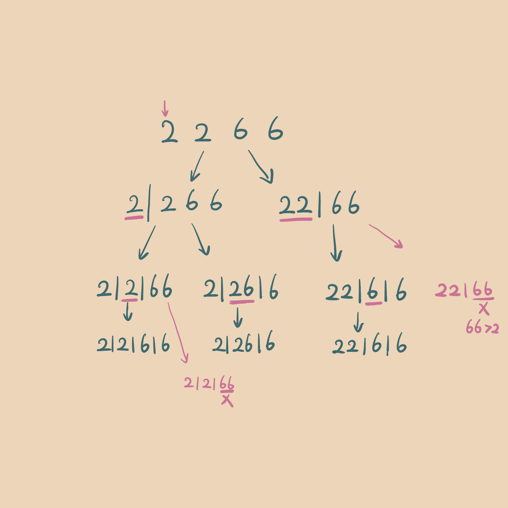

### [91. Decode Ways](./LC91DecodeWay.java)
---

#### Approach #1, DP
 n is the length of input string
 
dp[n]

dp[i] - the possible ways to decode from [0, i]

init: `dp[0] = s.charAt(0) == '0' ? 0 : 1` (0 should be skip)

transition: 

if current digit != 0, `dp[i] = dp[i - 1]`

if previous 2 digits [10, 26], then from index i - 2 to current have 2 decode ways

`dp[i] += dp[i - 2] (i >= 2)`

`dp[i] += 1 (i < 2)`

return `dp[n - 1]`

for example: "2266" 
```
idx = 0, 2 != 0, dp[0] = 1
idx = 1, 2 != 0, dp[1] = dp[0] = 1
    10 <= 22 <= 26, (1 < 2), dp[1] += 1 = 2
idx = 2, 6 != 0, dp[2] = dp[1] = 2
    10 <= 26 <= 26, dp[2] += dp[0] = 3
idx = 3, 6 != 0, dp[3] = dp[2] = 3
    66 > 26

result: dp[3] = 3
```
```java
public int numDecodings(String s) {
    if (s == null || s.length() == 0) return 0;
    int len = s.length();
    int[] dp = new int[len];
    dp[0] = s.charAt(0) == '0' ? 0 : 1;
    for (int i = 1; i < len; i++) {
      int curr = s.charAt(i) - '0';
      int prev = s.charAt(i - 1) - '0';
      if (curr != 0) dp[i] = dp[i - 1];
      int num = prev * 10 + curr;
      if (num >= 10 && num <= 26) {
        dp[i] += i >= 2 ? dp[i - 2] : 1;
      }
    }
    return dp[len - 1];
  }
```

#### Approach #2, recursive + memorization
As below example, there will be only two possible paths, from current index, either go itself or check with two digits [10,26].
Since we already put the same path (index mapping result) into Map (index as key, result as value).

There are `3` possible decode ways.


TC: O(N) - N is the length of input string
SC: O(N)

```java
public int numDecodes(String s) {
    if (s == null || s.length() == 0) return 0;
    return helper(s, 0, new HashMap<Integer, Integer>());
  }
  private int helper(String s, int idx, Map<Integer, Integer> map) {
    if (idx == s.length()) return 1;
    if (map.containsKey(idx)) return map.get(idx);
    int res = 0;
    int curr = s.charAt(idx) - '0';
    if (curr != 0) res += helper(s, idx + 1, map);
    int num = (idx < s.length() - 1) ? curr * 10 + (s.charAt(idx + 1) - '0') : 0;
    if (num >= 10 && num <= 26) res += helper(s, idx + 2, map);
    map.put(idx, res);
    return res;
  }
```